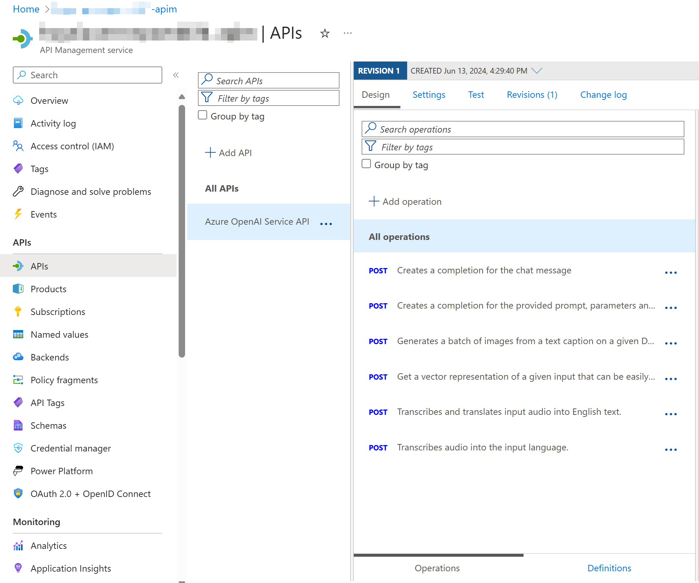
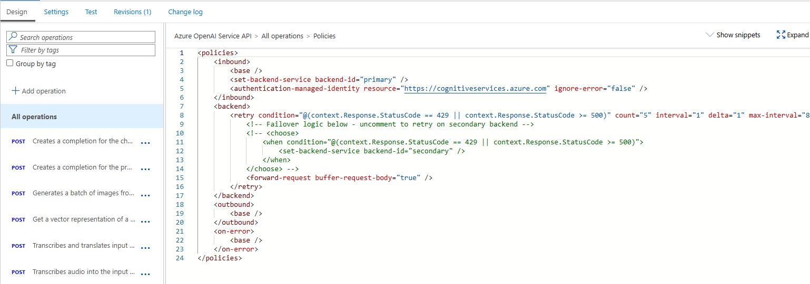

# Deployment Templates
This project includes templates for deploying and configuring an Azure API Management gateway to use in between the Azure Function and Azure OpenAI deployments. 

## Deploy and Configure APIM
Using the Azure CLI, use the `main.bicep` template to deploy and setup APIM for Azure OpenAI connectivity.

```powershell
az deployment group create -g rg-hygeia --template-file main.bicep --parameters "aoaiPrimaryAccount=[AZURE_OPENAI_NAME]" --parameters "aoaiSecondaryAccount=[AZURE_OPENAI_NAME]" --parameters "sku=[SKU_NAME]" --parameters "applicationInsightsName=[APP_INSIGHTS_NAME]"
```

* [AZURE_OPENAI_NAME]: The resource name your Azure OpenAI deployments are in. If you only have one Azure OpenAI resource, you can use the same name in both Primary and Secondary. The policy to enable fail over is included as an example, but is not enabled by default.
* [SKU_NAME]: Options are: 'Consumption' 'Developer' 'Standard' 'Premium'
* [APP_INSIGHTS_NAME]: name of App Insights resource for logging

Use the optional parameters below by adding each in the following format to the command above:

```powershell
--parameters "[PARAMETER]=[VALUE]
```

| Parameter | Use | Value |
|---|---|---|
| apimName | if deploying to an existing APIM resource | the name of the APIM resource |
| managedIdentityPrincipalName | if not included, APIM will be provisioned with a system defined identity. Use this parameter to specifiy a user-defined identity instead | the name of the service principal to set as the managed identity

## Check the Deployment

### API Definition
Open the deployed API Managmeent resource to confirm deployed configurations.

In the `APIs` blade, an API definition for Azure OpenAI is created with all available operations:



### InBound Policies

In the API definition, click on `All operations` and then the `</>` icon in the InBound processing tile to see the policies applied:



### Backends

Click the `Backends` blade to see the primary and secondary backends defined:


